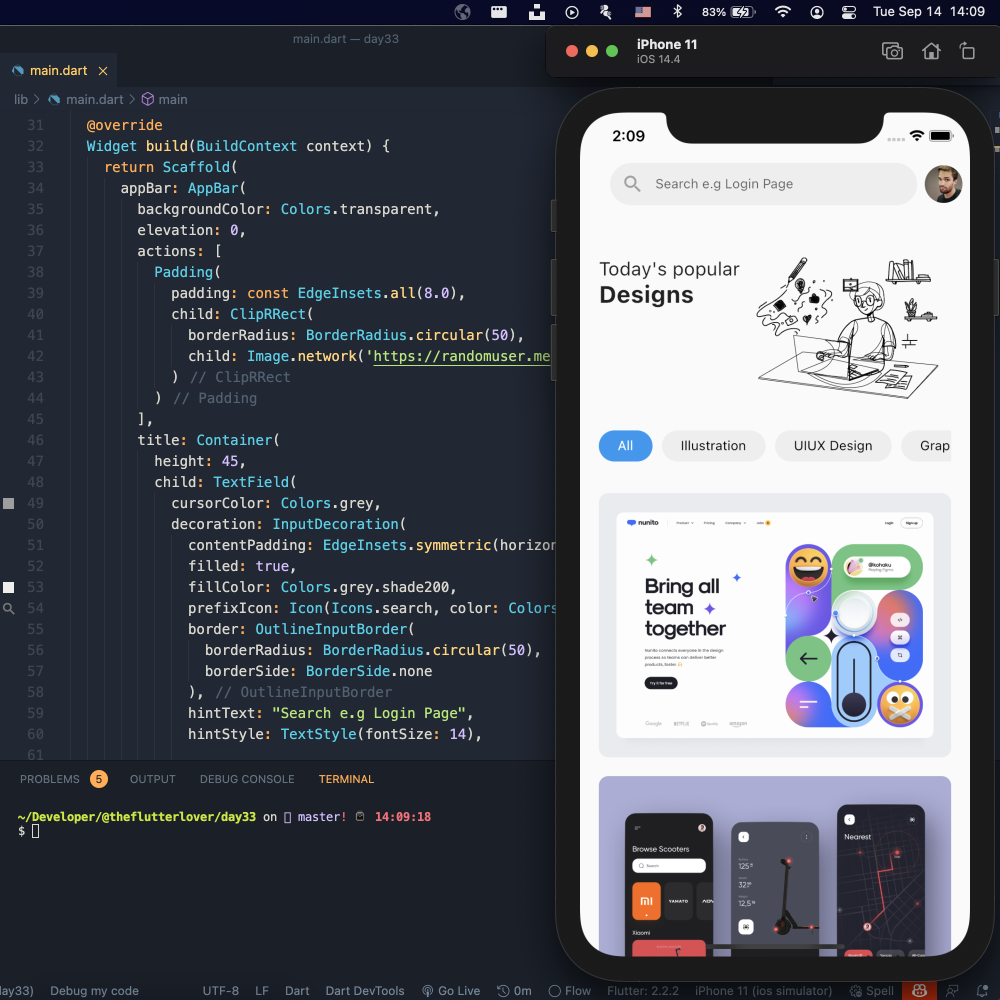
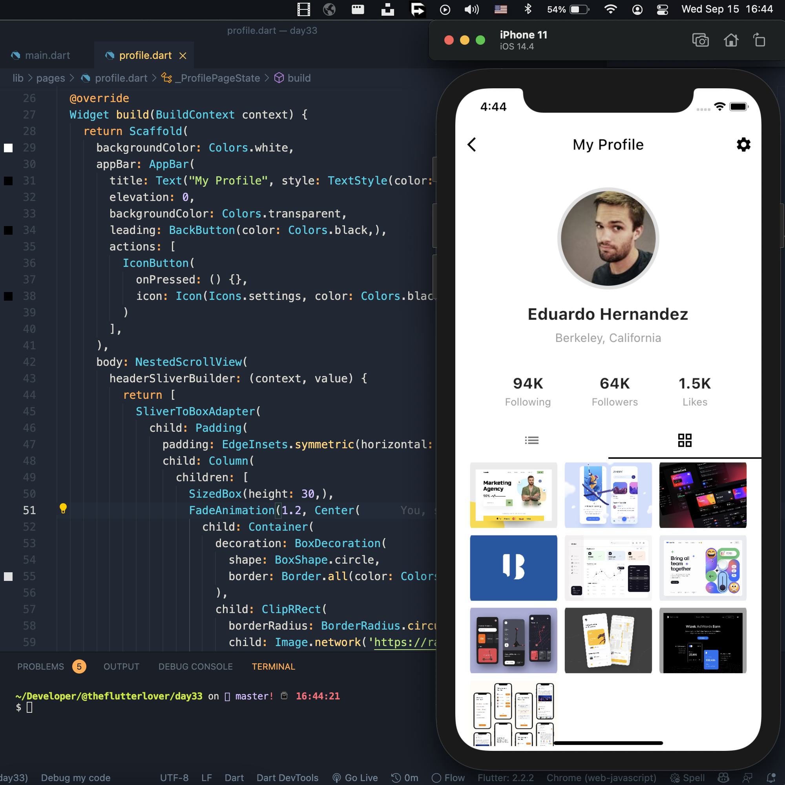
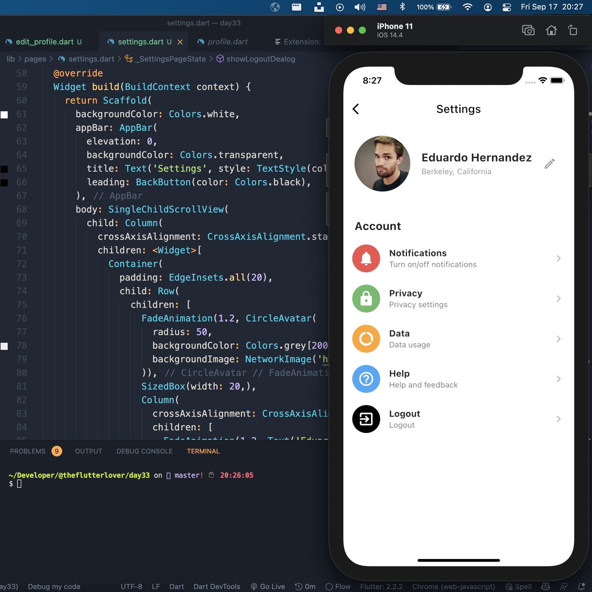

## Flutter Portfolio App Concept - Day 33

```dart
class Afgprogrammer extends Flutter100DaysOfCode {
  video() {
    return {
      "title": "Flutter Portfolio App Concept",
      "description": "Let’s make a portfolio app.",
      "day": 33,
    }
  }
}
```

Design assets from: dribbble, icon8

## Previous Designs
[Checkout my Youtube channel](https://youtube.com/afgprogrammer)


## Development Setup
Clone the repository and run the following commands:
```
flutter pub get
flutter run
```

## Screenshot
### Home Page


### Profile Page


### Settings Page


## Links

* [Website](https://afgprogrammer.com)
* [Youtube channel](https://youtube.com/afgprogrammer)
* [Twitter](https://twitter.com/afgprogrammer)
* [Instagram](https://instagram.com/afgprogrammer)
